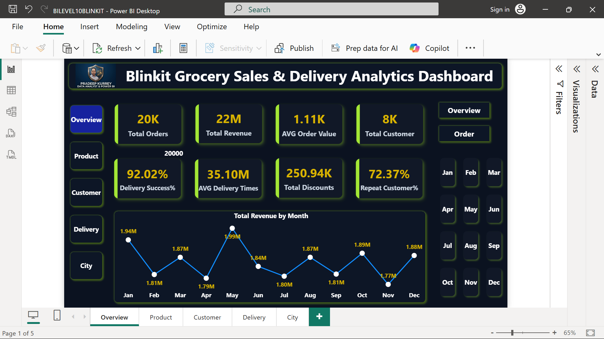
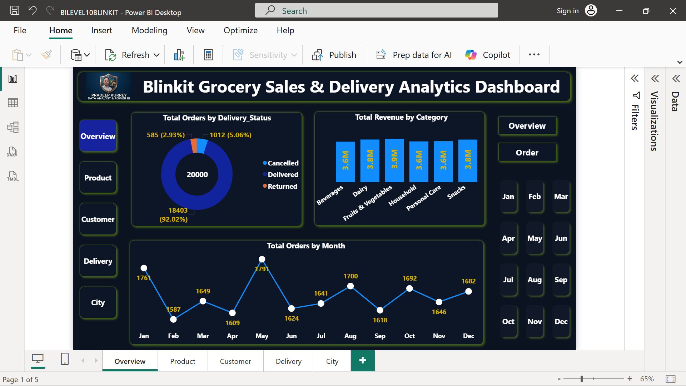
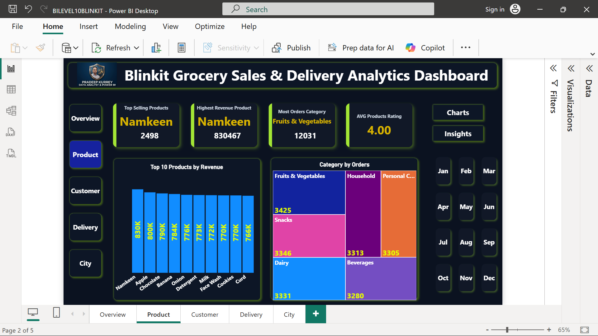
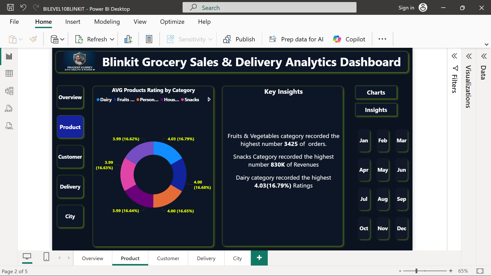
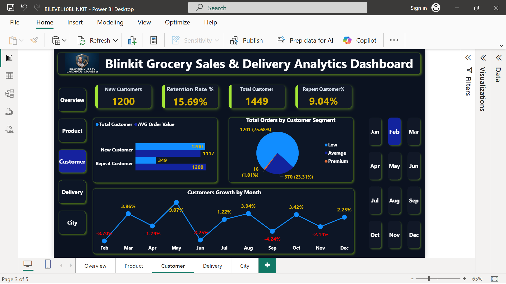
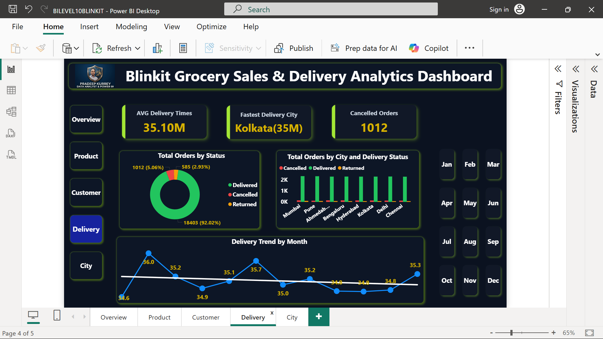
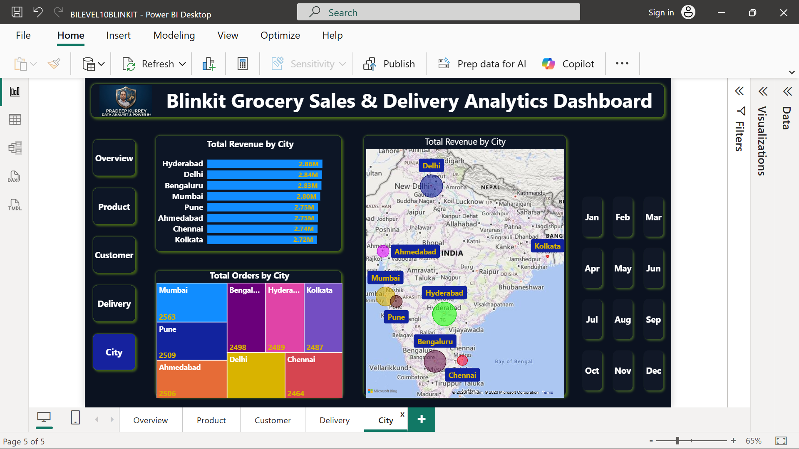

# Blinkit Grocery Sales & Delivery Analytics Dashboard

## Project Overview
This Power BI dashboard analyzes Blinkit grocery sales, delivery performance, customer behavior, 
and product insights using interactive visualizations and KPIs.

---

## Features
- Sales & Revenue Analysis
- Delivery Performance Tracking
- Customer Retention Analysis
- Product Performance Insights
- Monthly Trends Analysis
- Interactive Filters & Navigation
- Business Insights Dashboard

---

## 🛠️ Tools & Technologies

| Tool        | Purpose                  |
|------------|-------------------------|
| Power BI    | Data Visualization      |
| DAX         | Calculations & Metrics  |
| Power Query | Data Cleaning           |

---

## Key Insights
- Fruits & Vegetables category generated the highest orders.
- Namkeen emerged as the top revenue-generating product.
- Delivery success rate exceeded 92%.
- Repeat customers contributed over 72% of total customers.

---

## Dashboard Preview

### Overview Page

### Product Analysis

### Customer Analysis

### Delivery Page

### City Page

## 📂 Dataset
[Download PBIX File](BILEVEL10BLINKIT.pbix)
[Excel / CSV File](blinkit_grocery_dataset.csv)
## 🚀 How to Use

1. Download .pbix file  
2. Open in Power BI Desktop  
3. Explore interactive visuals

---

## Project Highlights

- Designed a fully interactive Blinkit Grocery Analytics Dashboard in Power BI
- Analyzed sales, revenue, delivery performance, and customer behavior
- Created KPI cards, trend analysis, and business insight visuals
- Implemented interactive slicers and page navigation buttons
- Built customer retention and repeat customer analysis
- Designed a modern dark-theme dashboard UI inspired by Blinkit branding
- Used DAX measures for advanced calculations and KPIs
- Created insights-driven storytelling dashboard for business decision-making

---

## Connect With Me

### LinkedIn
[LinkedIn](https://www.linkedin.com/in/pradeep-kurrey-data-analyst)

## Author
Pradeep Kurrey
